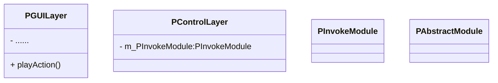

# FrameFlow
一个实现windows壁纸播放的程序

## 程序功能

## 内容架构设计（后面移到开发文档之类的地方）
> 使用的第三方库：
> 
> 功能模块：
> 
> ……抽象类和接口等等

```mermaid
%%pycharm的mermaid无法识别中文
classDiagram
class PGUILayer{
    + playAction()
    - ......
}
class PControlLayer{
    - m_PInvokeModule:PInvokeModule
}
class PInvokeModule{
    
}
class PAbstractModule{
    
}
```
<!-- markdown version 0.1.0>